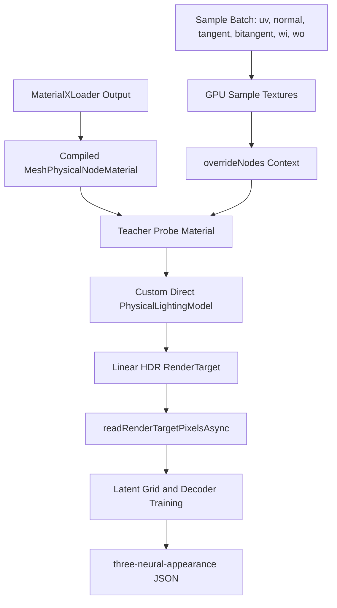

# Directional GPU Teacher

## Background

The current training path in [examples/jsm/materials/NeuralAppearanceTeacherEvaluator.js](examples/jsm/materials/NeuralAppearanceTeacherEvaluator.js) is still not a true BRDF teacher. It renders the MaterialX material once from a front-facing plane and samples that radiance atlas later. That can look close from the default view, but it cannot learn how highlights or color should change with view/light direction, which explains the red/yellow/green shifts when rotating the torus.

The old analytical MaterialX extraction path has been removed from automatic training. That is good: training should not parse `base_color`, roughness, carpaint parameters, or other MaterialX inputs manually. The correct source of truth is the `MeshPhysicalNodeMaterial` produced by [examples/jsm/loaders/MaterialXLoader.js](examples/jsm/loaders/MaterialXLoader.js), evaluated by WebGPU.

three.js already has the needed node infrastructure:

- [src/nodes/core/OverrideContextNode.js](src/nodes/core/OverrideContextNode.js) provides `overrideNode()` / `overrideNodes()` for replacing nodes inside a compiled graph.
- [src/nodes/accessors/Normal.js](src/nodes/accessors/Normal.js), [src/nodes/accessors/Tangent.js](src/nodes/accessors/Tangent.js), [src/nodes/accessors/Bitangent.js](src/nodes/accessors/Bitangent.js), and [src/nodes/accessors/Position.js](src/nodes/accessors/Position.js) expose `normalView`, `tangentView`, `bitangentView`, and `positionViewDirection`.
- [src/nodes/accessors/AccessorsUtils.js](src/nodes/accessors/AccessorsUtils.js) defines `TBNViewMatrix`, which the neural runtime uses in [examples/jsm/materials/NeuralAppearanceNodeMaterial.js](examples/jsm/materials/NeuralAppearanceNodeMaterial.js).
- [examples/webgpu_lights_custom.html](examples/webgpu_lights_custom.html) shows `lights().context({ lightingModel })`, which can install a custom direct lighting model for a material.
- [src/nodes/functions/PhysicalLightingModel.js](src/nodes/functions/PhysicalLightingModel.js) is the shader-side Physical BRDF implementation that should evaluate the MaterialX material.

The key change: do not rotate the preview mesh to create training samples. Rotation belongs only in the e2e harness to prove the model generalizes. The teacher pass should set all geometric/shading inputs per sample in shader code.

## Target Architecture

## Implementation Plan

### 1. Replace frontal atlas sampling with per-sample shader overrides

Update [examples/jsm/materials/NeuralAppearanceTeacherEvaluator.js](examples/jsm/materials/NeuralAppearanceTeacherEvaluator.js) so `evaluate(samples)` renders a batch atlas where each sample occupies a small tile or pixel group.

For each sample, upload these values into nearest-filtered GPU textures or storage buffers:

- `uv`: MaterialX UV coordinate.
- `normal`: tangent-space or view-space surface normal, usually `[0, 0, 1]` for canonical BRDF queries.
- `tangent` and `bitangent`: canonical frame axes.
- `wi`: incoming light direction in tangent/view frame.
- `wo`: outgoing/view direction in tangent/view frame.

Use `overrideNodes()` to replace:

- `uv()` with the per-sample UV read from the sample texture.
- `normalView` with the per-sample normal.
- `tangentView` and `bitangentView` with the per-sample frame.
- `positionViewDirection` with the per-sample `wo`.

This makes MaterialX textures, procedurals, normal maps, roughness maps, carpaint lobes, and other node-driven inputs evaluate through the same shader graph that the preview uses.

### 2. Use a controlled direct-light Physical lighting model

Add an internal `NeuralTeacherLightingModel` that extends or wraps `PhysicalLightingModel`.

Its direct pass should:

- Read per-sample `wi` from the sample texture.
- Use white unit light color.
- Call the normal Physical direct BRDF path with the overridden `normalView` and `positionViewDirection`.
- Suppress indirect lighting, environment lighting, hemisphere lighting, emissive-only shortcuts, and tone mapping.

The output render target must be linear, non-tonemapped HDR-compatible data. Prefer `HalfFloatType` or `FloatType` with `NoColorSpace`; use `UnsignedByteType` only as a fallback if WebGPU readback support requires it.

### 3. Make sampling deterministic and derivative-safe

A single pixel per sample can break MaterialX texture filtering because derivatives are undefined or too coarse. Use small tiles, for example `4x4` pixels per sample:

- Read the center pixel as the target.
- Vary UV affinely across the tile to produce stable `dFdx` / `dFdy`.
- Use the requested mip footprint to train base and mip-level latent grids.

This is also where normal maps can be tested: the base frame is overridden, but MaterialX normal nodes still perturb the material normal through the real shader path.

### 4. Train against GPU readback only

Update [examples/jsm/materials/NeuralAppearanceTrainer.js](examples/jsm/materials/NeuralAppearanceTrainer.js):

- Generate deterministic training and validation sample batches with `uv`, `wi`, `wo`, and canonical frame values.
- Ask the GPU teacher for targets in batches, not one sample at a time.
- Remove any remaining assumptions that teacher inputs contain parsed MaterialX parameters.
- Keep latent-grid training and decoder training, but make validation error compare against held-out GPU teacher targets.
- Export `referenceEvaluations` generated from GPU teacher targets and runtime decoder predictions, not analytical BRDF values.

### 5. Align runtime and teacher conventions

The runtime in [examples/jsm/materials/NeuralAppearanceNodeMaterial.js](examples/jsm/materials/NeuralAppearanceNodeMaterial.js) computes:

- `incomingDirection = lightDirection.mul(TBNViewMatrix).normalize()`
- `viewDirection = positionViewDirection.mul(TBNViewMatrix).normalize()`

The teacher must use the same tangent-frame convention. Add a small shared CPU utility or documented helper tests so trainer-side reference evaluation, JSON export, and runtime shader all agree on:

- handedness of tangent/bitangent/normal,
- whether `wi` and `wo` are surface-to-light / surface-to-camera,
- whether the neural decoder output includes `nDotL`,
- how learned frame rotation weights transform directions.

### 6. Strengthen tests around the actual failure

Update [test/e2e/neural-appearance-training.js](test/e2e/neural-appearance-training.js):

- Keep the `5%` foreground-different-pixel gate for constant blue/red/green.
- Keep multi-rotation comparisons; front-only screenshots are insufficient.
- Keep forced-white negative control.
- Remove hue-specific special cases; foreground visual error should be enough.

Add focused WebGPU teacher tests:

- Constant blue/red/green MaterialX teacher outputs match the same material rendered in the example lighting setup.
- Changing `wi` changes the teacher target for glossy/carpain materials.
- Changing `wo` moves/specularly changes highlights for glossy/carpain materials.
- UV-varying fixture targets vary across UV and train a non-constant latent grid.

### 7. Clean up temporary compromises

After the directional teacher lands:

- Remove the current frontal-radiance atlas approximation from [NeuralAppearanceTeacherEvaluator.js](examples/jsm/materials/NeuralAppearanceTeacherEvaluator.js).
- Keep the training example static by default, with `?noRotate=0` as an explicit interactive option.
- Ensure [examples/webgpu_materials_neural_appearance_train.html](examples/webgpu_materials_neural_appearance_train.html) reports training loss, validation loss, active material type, and render frame token.

## Expected Outcome

- Constant blue, red, and green fixtures should be well below `5%` foreground difference across fixed rotations.
- Glossy and carpaint materials should keep highlight width and hue stable as the object rotates.
- Textured/procedural MaterialX should train from GPU-evaluated node graphs without any manual parameter extraction.
- If the GPU teacher cannot override a required node, training should fail loudly instead of producing plausible but wrong colors.