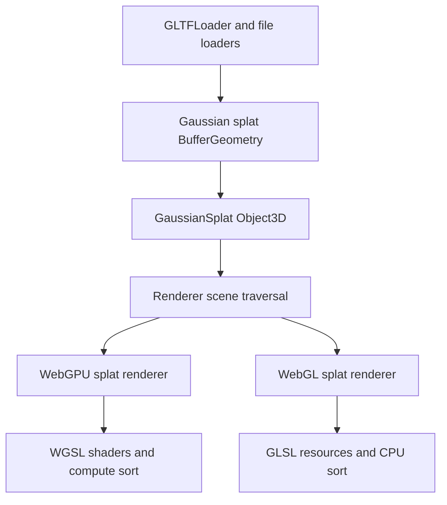

# First-Class Gaussian Splat Primitive

## Goal
Add `GaussianSplat` as a first-class scene object, similar in status to `Mesh`, `Points`, and `Line`, but backed by splat-specific renderer paths instead of normal material shaders.

The object should own only scene/data semantics: transform, bounds, splat geometry, sorting policy, and render state. WebGPU and WebGL implementations should live in renderer-specific code.

## Proposed Shape
- Add `[src/objects/GaussianSplat.js](src/objects/GaussianSplat.js)` as an `Object3D` subclass with `isGaussianSplat = true`, `type = 'GaussianSplat'`, `geometry`, `material`, and `splatGeometry` alias only if needed for compatibility.
- Add `[src/materials/GaussianSplatMaterial.js](src/materials/GaussianSplatMaterial.js)` as a lightweight render-state material: transparent, depthWrite false, depthTest true, sorting thresholds, max screen size, kernel size. It should not contain GLSL or TSL code.
- Export both from `[src/Three.Core.js](src/Three.Core.js)` only for the experiment. If maintainers reject core status, the same shape can move back to `examples/jsm`.

## Renderer Integration
- Update scene traversal in `[src/renderers/WebGLRenderer.js](src/renderers/WebGLRenderer.js)` and `[src/renderers/common/Renderer.js](src/renderers/common/Renderer.js)` so `object.isGaussianSplat` is collected like `Mesh`, `Line`, and `Points`.
- Update compile/prepass paths that currently filter renderables by `isMesh || isPoints || isLine || isSprite`.
- Update render info accounting in `[src/renderers/common/Info.js](src/renderers/common/Info.js)` so splats report a meaningful count instead of hitting “Unknown object type”.
- Keep frustum behavior conservative at first: use `geometry.boundingSphere` and allow `frustumCulled = false` by default if screen-space extents make bounds unreliable.

## WebGPU Path
- Add a WebGPU renderer helper under `[src/renderers/webgpu/](src/renderers/webgpu/)`, responsible for:
  - Creating the instanced quad geometry internally.
  - Creating storage buffers from `GaussianSplat.geometry` attributes.
  - Running reset/histogram/prefix/scatter compute sort with WGSL compute pipelines.
  - Building a WGSL render pipeline for splat projection and fragment evaluation.
- Port the math from `[examples/jsm/objects/GaussianSplatMesh.js](examples/jsm/objects/GaussianSplatMesh.js)` into explicit WGSL shader strings/modules. The scene object should import no `three/webgpu`, `three/tsl`, `NodeMaterial`, or TSL helpers.
- Use renderer-owned bind groups for center, covariance, color, order, histogram, offsets, and uniforms. Keep data packing aligned with the current `vec4` storage layout so the port is mostly mechanical.
- Prefer a custom splat draw path when `renderObject.object.isGaussianSplat` is encountered, rather than disguising the primitive as a hidden `NodeMaterial` mesh. This makes the experiment test whether first-class primitives belong in the backend.
- Keep the first WGSL port intentionally direct: match the current TSL sort and projection behavior before optimizing pipeline reuse or buffer packing.

## WebGL Path
- Add a WebGLRenderer helper under `[src/renderers/webgl/](src/renderers/webgl/)` responsible for:
  - CPU sorting when camera movement exceeds thresholds.
  - Building a WebGL2 `RawShaderMaterial`/program path using GLSL.
  - Rendering instanced quads with per-splat attributes, or texture-backed splat data if attribute limits become a blocker.
- Start with the simpler WebGL implementation: sorted instanced attributes for center, covariance, and color. This avoids TSL and mirrors the WGSL render shader in GLSL.
- Optimize later by uploading stable splat data once and only updating an order attribute/texture.

## Loader And Editor Changes
- Update `[examples/jsm/loaders/GLTFLoader.js](examples/jsm/loaders/GLTFLoader.js)` so `KHR_gaussian_splatting` parsing creates the shared splat `BufferGeometry`, then returns `new GaussianSplat( geometry )` rather than importing `GaussianSplatMesh`.
- Update file loaders and editor import paths in `[editor/js/Loader.js](editor/js/Loader.js)` to create `GaussianSplat` from PLY/SPLAT/SPZ/KSPLAT geometry.
- Update `[examples/webgpu_gaussian_splatting.html](examples/webgpu_gaussian_splatting.html)` to use `GaussianSplat`; the example should no longer explicitly own renderer-specific mesh classes.

## Compatibility And Tests
- Add unit tests for the `GaussianSplat` object contract: type flag, geometry attributes, bounds, clone/copy/toJSON expectations if supported.
- Extend GLTF loader/exporter tests to assert that `KHR_gaussian_splatting` returns `isGaussianSplat` with valid geometry.
- Add focused renderer smoke tests if feasible: one WGSL WebGPU path and one GLSL WebGLRenderer path with a tiny debug splat set.
- Keep existing parser/math tests for SPLAT/SPZ/KSPLAT/PLY conversion.

## Risks
- This touches core renderers, so it is much larger and less conventionally “addon-sized” than separate `GaussianSplatMeshWebGPU`/`GaussianSplatMeshWebGL` modules.
- The normal material pipeline assumes renderable objects have ordinary geometry/material shader paths. A first-class primitive may need custom branches in multiple places.
- A WGSL-native WebGPU path bypasses TSL/NodeMaterial conveniences, so uniform binding, color management, clipping, tone mapping, and pipeline cache integration must be handled deliberately.
- WebGL and WebGPU coordinate systems, depth, alpha blending, and sort behavior must match closely enough for screenshots/tests.
- Maintainers may prefer this to remain an addon until the primitive and extension stabilize.

## Suggested Experiment Boundary
Keep the first pass intentionally narrow: one `GaussianSplat` object, one default material, local/debug data, CPU sort for WebGL, WGSL compute sort for WebGPU, no TSL dependency, no spherical harmonics beyond degree 0, no raycasting, and no public customization beyond the current options.