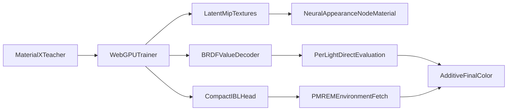

# Neural Appearance Direction Plan

## Current Implementation Snapshot

The example at [`/Users/bhouston/Coding/OpenSource/three.js/examples/webgpu_materials_neural_appearance.html`](/Users/bhouston/Coding/OpenSource/three.js/examples/webgpu_materials_neural_appearance.html) trains a MaterialX teacher into a compact material asset and renders it through [`/Users/bhouston/Coding/OpenSource/three.js/examples/jsm/neural/NeuralAppearanceNodeMaterial.js`](/Users/bhouston/Coding/OpenSource/three.js/examples/jsm/neural/NeuralAppearanceNodeMaterial.js).

The runtime shape is already close to the rasterization literature in a few places:

- Latents are 8 channels in two RGBA textures, with a full learned mip pyramid serialized by [`NeuralAppearanceManifest.js`](/Users/bhouston/Coding/OpenSource/three.js/examples/jsm/neural/NeuralAppearanceManifest.js).
- Runtime LOD uses UV derivatives and explicit texture levels in [`NeuralAppearanceTSL.js`](/Users/bhouston/Coding/OpenSource/three.js/examples/jsm/neural/NeuralAppearanceTSL.js): `computeContinuousLOD()` computes a footprint and `fetchLatentTexels()` samples `.level( levelNode )`.
- Direct lighting is additive and per-light: `NeuralAppearanceLightingModel.direct()` calls `evaluateNeuralBRDF()` for each light direction and adds the result to `directDiffuse`.
- Shader execution is already unrolled through TSL: `evaluateMLP()` packs scalar inputs into `vec4`s and `linearLayerPacked()` emits vectorized dot-style work over uniform-packed weights.
- IBL is partially split out: `evaluateNeuralIBLForTexels()` runs a separate 14-input IBL head, predicts reflectance/roughness/weights, and samples the scene PMREM environment.

## Comparison Against The Proposed Direction

- Footprint / aliasing: the current code has a NeuMIP-like latent mip pyramid and UV-gradient LOD, but the mip levels are independently optimized fields. It does not yet enforce hierarchical consistency, train the trilinear runtime path directly, or use the existing LEAN helper in [`NeuralAppearanceFilterUtils.js`](/Users/bhouston/Coding/OpenSource/three.js/examples/jsm/neural/NeuralAppearanceFilterUtils.js) for normal/roughness prefiltering.
- Execution overhead: the current TSL path is already a direct pixel-shader MLP with packed vector operations. It is a good fit for three.js because it avoids custom WGSL/HLSL and keeps the material portable inside the node system. The remaining work is mainly reducing decoder inputs and shader variants, not adding wave/tensor-specific code.
- Indirect lighting / IBL: the current implementation uses a compact learned IBL head plus PMREM fetches, but not the exact “prefiltered sample ingestion” pattern. It predicts parameters for PMREM sampling instead of feeding the fetched HDR env color into the main decoder. Also, the IBL target generation is heuristic and single-phase; `generateIBLTrainingSamples()` exists but the trainer currently uses `generateTrainingSamples()` only.
- Normal mapping detail: the current model has learned dual shading frames embedded before the BRDF decoder, which is conceptually aligned with shading-frame priors. But those frames are not supervised by explicit normal/roughness targets or regularized for smoothness/orthogonality, and training samples use a flat canonical frame.

## Recommended Direction

### 1. Make The Existing IBL Head Consistent First

Before changing the asset format, tighten the current IBL path:

- In [`NeuralAppearanceTSL.js`](/Users/bhouston/Coding/OpenSource/three.js/examples/jsm/neural/NeuralAppearanceTSL.js), use the IBL head's predicted diffuse direction at runtime instead of always sampling diffuse PMREM at the canonical normal.
- In [`NeuralAppearanceSampler.js`](/Users/bhouston/Coding/OpenSource/three.js/examples/jsm/neural/NeuralAppearanceSampler.js), replace per-record `assignIBLTargets()` for IBL supervision with grouped quadrature from `generateIBLTrainingSamples()`.
- In [`NeuralAppearanceTrainer.js`](/Users/bhouston/Coding/OpenSource/three.js/examples/jsm/neural/NeuralAppearanceTrainer.js), add a second IBL-only phase that freezes BRDF weights and latents, then optimizes only the compact IBL head.
- In [`NeuralAppearanceValidator.js`](/Users/bhouston/Coding/OpenSource/three.js/examples/jsm/neural/NeuralAppearanceValidator.js), add an environment-integral validation metric comparing compact IBL output against brute-force BRDF integration or teacher quadrature.

This is the lowest-risk bridge because it preserves the current format while improving the part that most diverges from the literature.

### 2. Add Prefiltered Environment Ingestion As A New Runtime Mode

Introduce a new optional IBL ingestion head rather than replacing the existing BRDF decoder immediately:

- Keep the direct value decoder as `f(z, V, L)` for explicit lights.
- Add an indirect decoder path shaped like `g(z, V, N_proxy, envDiffuse, envSpecular, roughnessOrLod)`.
- Fetch PMREM diffuse/specular samples in [`NeuralAppearanceTSL.js`](/Users/bhouston/Coding/OpenSource/three.js/examples/jsm/neural/NeuralAppearanceTSL.js), then pass those sampled HDR values into the indirect decoder as inputs.
- Store the new head behind a versioned manifest extension in [`NeuralAppearanceFormat.js`](/Users/bhouston/Coding/OpenSource/three.js/examples/jsm/neural/NeuralAppearanceFormat.js) and [`NeuralAppearanceManifest.js`](/Users/bhouston/Coding/OpenSource/three.js/examples/jsm/neural/NeuralAppearanceManifest.js), while keeping v3 loading intact.

The goal is not to make the network invent lighting. It should learn material modulation of prefiltered incoming radiance, while the engine keeps doing PMREM selection and additive light accumulation.

### 3. Add Proxy Parameter Outputs For IBL Queries

To avoid the chicken-and-egg problem, add a small latent-only proxy head:

- Inputs: 8D latent code, optionally mip level or footprint scalar.
- Outputs: tangent-space normal or frame delta, effective roughness, diffuse/specular weights.
- Use these values only to choose PMREM direction and mip level, then feed the resulting env samples into the indirect decoder.

This aligns with the “Auxiliary Parameter Head” and “Analytic BRDF Proxy” approaches while staying small enough for three.js examples.

### 4. Strengthen Latent MIP Training

Improve the NeuMIP alignment without abandoning the current learned pyramid:

- Train the same interpolation mode used at runtime, especially trilinear latent interpolation.
- Add a coarse-to-fine consistency loss so adjacent mip levels represent filtered versions of the same material response.
- Wire `prefilterLeanNormalRoughness()` into teacher sampling experiments for normal-mapped materials.
- Add tests around fixed mip, derivative LOD, trilinear inference, and coarse-mip stability.

### 5. Turn Learned Frames Into Explicit Shading-Frame Priors

The current dual-frame layer is promising and should be kept, but made more deliberate:

- Add optional normal/frame target extraction from MaterialX teacher readback where available.
- Add frame regularizers during GPU training: unit length, tangent-normal separation, smoothness across neighboring latent texels, and temporal stability across mips.
- Add validation diagnostics for normal-map fixtures, grazing specular, white furnace, and reciprocity.

## Implementation Order

1. IBL correctness and validation: predicted diffuse direction, quadrature targets, frozen IBL phase, environment-lit tests.
2. Proxy head: latent-to-normal/roughness/weights, used only for PMREM direction and LOD.
3. Prefiltered ingestion head: PMREM samples become network inputs for indirect lighting.
4. MIP training upgrades: runtime-mode trilinear training plus cross-mip consistency.
5. Shading-frame priors: explicit losses and normal-map diagnostics.

## Main Files To Touch Later

- [`/Users/bhouston/Coding/OpenSource/three.js/examples/jsm/neural/NeuralAppearanceTSL.js`](/Users/bhouston/Coding/OpenSource/three.js/examples/jsm/neural/NeuralAppearanceTSL.js): runtime decoder inputs, PMREM fetches, latent LOD behavior.
- [`/Users/bhouston/Coding/OpenSource/three.js/examples/jsm/neural/NeuralAppearanceNodeMaterial.js`](/Users/bhouston/Coding/OpenSource/three.js/examples/jsm/neural/NeuralAppearanceNodeMaterial.js): lighting-model accumulation and indirect path selection.
- [`/Users/bhouston/Coding/OpenSource/three.js/examples/jsm/neural/NeuralAppearanceModel.js`](/Users/bhouston/Coding/OpenSource/three.js/examples/jsm/neural/NeuralAppearanceModel.js): model heads, frame/proxy outputs, CPU reference shape.
- [`/Users/bhouston/Coding/OpenSource/three.js/examples/jsm/neural/NeuralAppearanceGPUCompute.js`](/Users/bhouston/Coding/OpenSource/three.js/examples/jsm/neural/NeuralAppearanceGPUCompute.js): losses, frozen-head training, proxy and ingestion backprop.
- [`/Users/bhouston/Coding/OpenSource/three.js/examples/jsm/neural/NeuralAppearanceSampler.js`](/Users/bhouston/Coding/OpenSource/three.js/examples/jsm/neural/NeuralAppearanceSampler.js): IBL quadrature targets and footprint-aware samples.
- [`/Users/bhouston/Coding/OpenSource/three.js/examples/jsm/neural/NeuralAppearanceValidator.js`](/Users/bhouston/Coding/OpenSource/three.js/examples/jsm/neural/NeuralAppearanceValidator.js): environment-integral and frame-prior validation.
- [`/Users/bhouston/Coding/OpenSource/three.js/test/unit/addons/neural/`](/Users/bhouston/Coding/OpenSource/three.js/test/unit/addons/neural/): focused unit coverage for sampler/model/runtime changes.
- [`/Users/bhouston/Coding/OpenSource/three.js/test/e2e/neural-appearance-training.js`](/Users/bhouston/Coding/OpenSource/three.js/test/e2e/neural-appearance-training.js): environment-lit regression fixtures.