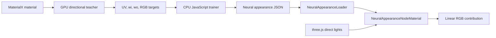

# Neural Appearance Rendering and Training: Current Baseline

Date: 2026-08-13

## Scope

This report describes the current implementation behind:

- `examples/webgpu_materials_neural_appearance.html`
- `examples/webgpu_materials_neural_appearance_train.html`

It documents what the code does today, where it differs from NVIDIA's Real-Time Neural Appearance Models pipeline, and which mismatches could explain the observed behavior: approximately correct dominant color and light-facing/back-facing response, with unstable rainbow colors near silhouettes as the object rotates.

The short diagnosis is that the prototype has the shape of a neural appearance system, but several parts that make the reference method stable are absent or disconnected. The strongest edge-specific suspects are the untrained latent mip pyramid and the derivative-built tangent frame. The trainer also exports a learned-frame layer that it never trains.

## System overview



The exported model contains:

- An 8-channel latent texture, stored as two RGBA textures.
- A 12-output linear layer intended to derive two shading frames from the latent code.
- A 20-input RGB MLP. Its inputs are the 8 latent values plus incoming and outgoing directions expressed in each of the two learned frames.
- A latent mip pyramid.

At runtime, the material evaluates the MLP once per direct light and multiplies its output by the geometric `nDotL`.

## Runtime rendering

### Example setup

The rendering example loads `examples/models/neural-appearance/faux-leather/neural_appearance.json`, parses it with `NeuralAppearanceLoader`, and creates `NeuralAppearanceNodeMaterial` (`examples/webgpu_materials_neural_appearance.html`, lines 103-125 and 189-201).

The scene uses:

- A torus knot with generated positions, normals, and UVs, but no tangent attribute.
- Two animated point lights.
- A hemisphere light, which the neural material does not use because its custom lighting model only handles direct-light callbacks.
- ACES filmic tone mapping at exposure 0.9.

The GUI can switch between the neural material and a hand-authored physical baseline, select deterministic or stochastic latent LOD, force a mip, and scale neural output intensity.

The bundled Faux Leather JSON is a tiny hand-authored fixture, not the output of the browser trainer or a production NVIDIA checkpoint. It has a 2×2 base latent texture, a 1×1 mip, zero frame-rotation weights, and a 20→4→3 decoder (`examples/models/neural-appearance/faux-leather/neural_appearance.json`, lines 1-108). Its value is format and runtime validation, not appearance fidelity.

### Loading and GPU representation

`NeuralAppearanceLoader` validates a version-1 manifest with exactly eight latent channels and a 20-input decoder (`examples/jsm/loaders/NeuralAppearanceLoader.js`, lines 242-320).

For each latent texture, it:

1. Converts JSON numbers to `Float32Array`.
2. Quantizes latent texels to half float.
3. Creates an `RGBAFormat`, `HalfFloatType`, `NoColorSpace` `DataTexture`.
4. Installs the supplied mip levels and disables GPU mip generation.
5. Uses linear texel filtering and trilinear mip filtering at the texture level, although the shader requests an explicit integer mip.

Decoder weights and biases remain float arrays and become uniform arrays in the node material (`NeuralAppearanceNodeMaterial.js`, lines 163-199).

### Per-light evaluation

For each direct light, `NeuralAppearanceLightingModel.direct()` evaluates the neural BRDF and accumulates:

```text
direct contribution = decoded RGB × max(wi.z, 0) × light color × intensity
```

The relevant code is in `NeuralAppearanceNodeMaterial.js`, lines 98-120.

The runtime performs these steps:

1. **Build tangent-space directions.** It transforms three.js view-space `lightDirection` and `positionViewDirection` with `TBNViewMatrix`, then normalizes them.
2. **Choose a latent LOD.** It measures screen-space UV derivatives in base-latent texels:

   ```text
   footprint = max(length(dFdx(uv) × latentSize),
                   length(dFdy(uv) × latentSize),
                   1)
   lod = clamp(log2(footprint), 0, mipCount - 1)
   ```

3. **Fetch eight latent values.** It samples two RGBA half-float textures at the chosen mip.
4. **Construct two learned frames.** A linear 8→12 layer produces two normal/tangent pairs. The code adds identity offsets to normal Z and tangent X, normalizes each vector, and computes `b = cross(n, t)`.
5. **Assemble 20 MLP inputs.** The first eight values are the latent code. The next twelve are `wi` and `wo` dotted against each of the two learned frames.
6. **Run the MLP.** Hidden layers support ReLU; the final output supports exponential, scaled-sigmoid, or non-negative linear output.
7. **Apply the cosine term.** The decoder predicts a BRDF-like value. Runtime lighting multiplies by geometric `max(wi.z, 0)`.

The implementation excludes indirect illumination, environment lighting, transmission sampling, multiple-bounce effects, and the paper's importance-sampling decoder.

### Runtime LOD modes

The deterministic mode rounds the computed LOD to the nearest integer (`NeuralAppearanceNodeMaterial.js`, lines 138-160). This can create visible boundaries or popping because it does not blend adjacent mip predictions.

The stochastic mode chooses either the floor or ceiling mip from a sine hash of UV. The hash does not include pixel coordinates, frame index, or a blue-noise source. It therefore creates a stable UV-space pattern rather than temporally averaged stochastic filtering.

## Browser training

### Example flow

The training page loads a MaterialX asset with `MaterialXLoader`, selects the first `MeshPhysicalNodeMaterial` when possible, and displays it on the same torus-knot preview (`examples/webgpu_materials_neural_appearance_train.html`, lines 208-342).

Pressing **Train** creates `NeuralAppearanceTrainer` with:

- Latent resolution: 8×8 by default.
- Iterations: 1,200.
- Batch size: 256.
- Seed: 1.
- Hidden width: 16, inherited from trainer defaults.

The page passes the live WebGPU renderer and MaterialX material to the trainer. When training finishes, it parses the exported JSON and renders a new `NeuralAppearanceNodeMaterial` in the same scene (`webgpu_materials_neural_appearance_train.html`, lines 344-424).

### GPU teacher

`NeuralAppearanceTeacherEvaluator` clones the MaterialX node material and renders batches into an offscreen atlas (`examples/jsm/materials/NeuralAppearanceTeacherEvaluator.js`, lines 139-196).

Each sample carries:

- UV and UV gradients.
- Canonical normal, tangent, and bitangent.
- Incoming direction `wi`.
- Outgoing/view direction `wo`.

The evaluator stores those values in float data textures. Each sample gets a 4×4 tile. UV varies across the tile so MaterialX texture nodes receive usable screen-space derivatives, and the trainer reads the center pixel (`NeuralAppearanceTeacherEvaluator.js`, lines 206-288 and 351-370).

The cloned material replaces default UV, `normalView`, `tangentView`, `bitangentView`, and `positionViewDirection`. A custom direct-only `PhysicalLightingModel` supplies the sample's `wi` with white unit radiance and suppresses indirect lighting (`NeuralAppearanceTeacherEvaluator.js`, lines 171-184 and 294-321).

The teacher renders to a non-tone-mapped, `NoColorSpace`, half-float target. If half-float readback fails, it silently falls back to unsigned-byte output (`NeuralAppearanceTeacherEvaluator.js`, lines 83-97 and 248-274).

### Training samples

`generateTrainingSamples()` stratifies UVs over a square grid and jitters each point. It samples direction pairs mostly through a Rusinkiewicz-inspired half/difference construction, with 10% of samples using a uniform sphere `wi` and uniform hemisphere `wo` (`NeuralAppearanceTrainer.js`, lines 100-147 and 755-805).

Every training sample uses the canonical frame:

```text
normal    = (0, 0, 1)
tangent   = (1, 0, 0)
bitangent = (0, 1, 0)
```

After teacher evaluation, the trainer converts outgoing direct radiance back to a BRDF-like target:

```text
target = teacher RGB / wi.z, when wi.z > 1e-4
weight = 0 otherwise
```

This matches the runtime's later multiplication by `wi.z` for an unperturbed canonical normal.

### Model and optimization

The trainer creates:

- A randomly initialized 8-channel latent grid.
- A 20→16→16→3 MLP by default.
- An 8→12 frame-rotation matrix initialized to zero.

It bilinearly samples the repeat-wrapped latent grid on the CPU. For every batch it:

1. Builds the 20 decoder inputs.
2. Runs the MLP.
3. Clamps RGB predictions to non-negative values.
4. Computes an L1 loss after a cube-root-style `powerLog` transform.
5. Backpropagates through the MLP.
6. Sends only the first eight input gradients to the latent texels.
7. Updates MLP parameters and latent texels with Adam.

The learning rate starts at 0.001 and cosine-anneals to 0.00001. A fixed held-out set of at most 64 samples supplies the displayed validation loss (`NeuralAppearanceTrainer.js`, lines 41-94 and 221-429).

### Export

Export writes the trained base latent grid to two RGBA arrays. It then creates lower-resolution levels by resampling the same base grid at the center of each coarse texel (`NeuralAppearanceTrainer.js`, lines 510-576).

The exporter also writes:

- The frame-rotation weights.
- All MLP weights and biases.
- The configured output activation.
- Three reference evaluations at UV `(0.5, 0.5)`.

The loader converts exported latent values to half float before runtime use.

## Differences from the reference method

The current code borrows the reference model's latent texture, two learned shading frames, compact decoder, UV/direction sampling, log-space loss, and runtime BRDF evaluation pattern. It does not reproduce the reference training system.

NVIDIA's paper describes:

- An encoder that maps material parameters to structured latent codes before direct latent optimization.
- Jointly trained frame extraction.
- Independently trained hierarchical latent levels using filtered material targets.
- Directional mollification for sharp lobes early in training.
- Roughly 300,000 iterations with 65,000 BRDF samples per iteration.
- A separate learned importance sampler.

The browser prototype directly optimizes a small latent grid and MLP for 1,200 × 256 samples by default, does not train the frame extractor, and synthesizes mips after training. This gap is large enough that weak approximation should be expected even if every coordinate convention is correct.

References:

- [Real-Time Neural Appearance Models](https://research.nvidia.com/labs/rtr/neural_appearance_models/)
- [Paper, arXiv v2](https://arxiv.org/html/2305.02678v2)
- [NVlabs/neuralappearance](https://github.com/NVlabs/neuralappearance)

## Findings and likely failure causes

### 1. The learned-frame layer is never trained

**Confidence: certain. Impact: high for quality, medium as the sole cause of rainbow edges.**

`rotationWeights` starts as 96 zeros (`NeuralAppearanceTrainer.js`, lines 149-159). The training loop has no gradient, Adam moments, or update for those weights. Backpropagation returns gradients for all 20 decoder inputs, but the trainer keeps only the first eight for direct latent-grid updates (`NeuralAppearanceTrainer.js`, lines 229-260).

The exported model therefore claims to contain two learned shading frames, but both remain the same canonical frame:

```text
n = (0, 0, 1)
t = (1, 0, 0)
b = (0, 1, 0)
```

The MLP receives duplicate direction features for both frames. This wastes 12 of its 20 inputs and removes one of the main graphics priors from the paper.

A correct implementation must backpropagate through frame extraction, vector normalization, cross products, and direction dot products. It must also include the frame-dependent path in latent gradients. Updating the 8→12 matrix alone would leave latent gradients incomplete.

### 2. Exported mips are not trained or appearance-filtered

**Confidence: certain. Impact: high, and strongly correlated with silhouette artifacts.**

Only the base latent grid participates in training. Export creates coarse mips by bilinearly resampling that grid. The decoder is nonlinear, so:

```text
decoder(average(latents)) != average(decoder(latents))
```

The reference method trains each latent level against a filtered material target. The current coarse levels have no loss attached to their runtime predictions.

Silhouette regions tend to have large screen-space UV derivatives and therefore select coarser latent mips. This gives a direct mechanism for the reported symptom: the center of the object can preserve the dominant color while edge pixels enter untrained latent mixtures that decode to unrelated RGB values. Rotation changes the projected UV footprint, so those colors move or change.

This problem can affect a spatially constant material. At the default 8×8 resolution, 64 independently initialized latent codes can converge to different equivalent encodings. Averaging those codes at lower mips need not preserve the same BRDF.

### 3. The runtime tangent frame differs from the canonical training frame

**Confidence: high. Impact: potentially high at silhouettes.**

`TorusKnotGeometry` supplies no tangent attribute (`src/geometries/TorusKnotGeometry.js`, lines 159-162). `TBNViewMatrix` therefore uses screen-derivative fallback vectors from `TangentUtils.js`.

Those fallback tangent and bitangent vectors share a scale based on the larger squared vector length; the code does not normalize each axis or Gram-Schmidt-orthogonalize the frame (`src/nodes/accessors/TangentUtils.js`, lines 8-46). The neural runtime then treats this matrix as a direction-changing tangent basis.

Training uses an exact identity frame. A skewed, non-unit, or derivative-unstable runtime frame changes the angular inputs seen by the MLP. Screen derivatives become least reliable near silhouettes, UV seams, and degenerate parameterizations, matching the location of the reported color failures.

The preview should compute a tangent attribute with `geometry.computeTangents()` as a first diagnostic. The material should also define whether it requires an orthonormal tangent frame and handle derivative-frame degeneracy explicitly.

### 4. Grazing-angle target normalization is ill-conditioned

**Confidence: high. Impact: high for edge stability and glossy materials.**

The teacher returns direct radiance, then the trainer divides by `wi.z` down to `1e-4`. Small half-float teacher errors become large BRDF target errors near grazing incidence. The cube-root loss derivative also grows as prediction approaches zero, and the optimizer has no gradient clipping.

For normal-mapped materials, the Physical teacher's cosine term follows the perturbed shading normal while normalization divides by canonical geometric `wi.z`. The resulting target contains a ratio of shading-normal and geometric-normal cosines. That ratio can become large near the geometric horizon.

The training distribution and validation set do not report error by angular region, so a low aggregate loss can hide poor grazing behavior.

### 5. The training budget and model capacity are far below the reference pipeline

**Confidence: certain. Impact: high.**

The default run sees about 307,000 samples. The paper describes tens of billions of online samples, directional mollification, an encoder phase, and a much longer optimization. The 16-wide decoder is small enough that seed sensitivity and channel-specific fitting errors are plausible.

RGB outputs have independent final weights and no hue, reciprocity, smoothness, or energy constraints. Underfitting at unseen or weakly sampled angles can therefore produce one large channel while the others stay near zero, which appears as rainbow hue shifts instead of a neutral brightness error.

### 6. Direct latent optimization leaves constant materials spatially inconsistent

**Confidence: high. Impact: medium to high at default resolution.**

A constant Lambert material does not need an 8×8 latent field, yet the default trainer optimizes 64 random latent vectors independently. Nothing penalizes neighboring latent differences or forces equal material parameters to share a code.

The paper's encoder supplies that structure. Without it, random latent variation can survive while the decoder fits sampled points. Linear texture filtering and coarse-mip resampling then combine latent codes in regions the decoder did not see during training.

For constant test materials, `resolution: 1` should be the baseline. If a 1×1 model still produces rainbow edges, latent mips and spatial inconsistency are ruled out, leaving frame/direction handling and angular underfitting as stronger suspects.

### 7. Validation does not test the runtime path

**Confidence: certain. Impact: high on diagnosis.**

The displayed validation loss covers at most 64 samples from the same CPU latent sampler, same canonical frame, same base grid, and same direction distribution as training. It does not cover:

- Half-float latent quantization.
- Exported coarse mips.
- Runtime LOD selection.
- Runtime tangent-frame construction.
- Actual mesh rotations and silhouettes.
- Teacher-versus-neural linear HDR output by angular bin.

The end-to-end screenshot test helps, but its constant-color cases use `resolution: 1`, which bypasses the default 8×8 mip failure. Its thresholds are also broad for glossy cases (`test/e2e/neural-appearance-training.js`, lines 14-26).

### 8. Unsigned-byte teacher fallback can corrupt glossy targets

**Confidence: certain code path, hardware-dependent occurrence. Impact: high when triggered.**

If half-float readback throws, the teacher retries with an unsigned-byte render target. That path quantizes values to 8 bits and cannot preserve HDR values above one. Glossy peaks can clip before training sees them. The UI reports no warning when this fallback occurs.

Training should fail loudly or expose the active target type before using LDR teacher data for BRDF distillation.

### 9. Output activation options can diverge between training and runtime

**Confidence: certain API issue. Impact: low for current defaults, high if configured.**

Training always optimizes a linearly produced output followed by a non-negative clamp. Export writes `options.outputActivation`, which can request exponential or scaled-sigmoid runtime output. The trainer does not apply those activations or their derivatives during optimization. The default is linear, so the example avoids this mismatch.

### 10. Color augmentation is disconnected from model inputs

**Confidence: certain. Impact: none at the default, harmful if enabled.**

Color augmentation permutes target RGB and selected `encoderInputs`, but `encoderInputs` never enter the model. Enabling the option can give the same UV/direction input conflicting channel-permuted targets. The current default disables it.

### 11. Some MaterialX features remain outside the controlled teacher state

**Confidence: medium. Impact: material-dependent.**

The teacher controls UV, frame, `wi`, and `wo`, which covers the simple opaque fixtures. Physical features that depend on world position, camera position, separate clearcoat normals, transmission context, or nodes not reached by UV replacement can still evaluate against the atlas plane rather than the abstract BRDF sample.

The page permits non-physical node materials and says it will use supported Physical defaults for unsupported surface nodes. This can produce plausible output from a different teacher than the user expects.

### 12. The LOD implementation can add discontinuities

**Confidence: certain. Impact: medium.**

Deterministic LOD rounds to one integer level instead of blending predictions. Stochastic LOD uses a low-quality, UV-locked hash. Both choices can make edge transitions visible even after mip training improves.

### 13. Independent RGB clamping can turn small errors into rainbow transitions

**Confidence: certain mechanism. Impact: medium near poorly fitted angles.**

The runtime's nominally `linear` output activation applies `max(0)` to each RGB channel independently (`NeuralAppearanceNodeMaterial.js`, lines 306-322). If angular or TBN error moves decoder outputs through zero at different rates, the clamp changes hue abruptly instead of producing a smooth signed error. ACES tone mapping can make the remaining saturated channel more visible.

Training applies the same clamp to predictions for the loss, but backpropagation treats the final MLP layer as linear. It therefore sends a straight-through gradient even when a raw channel is negative (`NeuralAppearanceTrainer.js`, lines 229-255 and 347-384). That choice can revive negative channels, but it is not the derivative of the loss that the forward pass computes and should be documented or replaced with an intentional positive output parameterization.

### 14. Teacher texture footprints do not match runtime footprints

**Confidence: certain. Impact: medium for textured materials.**

The trainer gives every teacher sample a small fixed UV gradient proportional to `1 / (resolution × 128)` (`NeuralAppearanceTrainer.js`, lines 120-125). Runtime MaterialX and neural LOD use the mesh's projected screen derivatives, which change across the torus and become large near silhouettes.

The teacher can therefore train against one filtered MaterialX value while the preview displays another footprint. Hierarchical training should sample footprint as an input and use the same footprint for teacher filtering and latent-level selection.

### 15. Repeat wrapping can expose UV-seam failures

**Confidence: high. Impact: material- and mesh-dependent.**

CPU latent sampling and runtime textures both use repeat wrapping, which is broadly consistent. The torus knot has UV seams, though, and neighboring texels across a seam only represent compatible appearance if training enforces periodic consistency. Random independently optimized latent codes and hard mip selection can make seam pixels decode to unrelated hues. Tests should report seam and non-seam edge errors separately.

## Most useful diagnostic sequence

Run these experiments in order. Each one removes a major variable.

1. **Train constant Lambert at resolution 1 and force runtime mip 0.**
   - Expected: stable hue over the full visible hemisphere.
   - Failure points to angular sampling, tangent-frame mismatch, optimizer stability, or train/runtime direction conventions.

2. **Train at resolution 8, then compare automatic LOD with forced mip 0.**
   - If forced mip 0 removes rainbow edges, the synthesized mip pyramid is the primary cause.

3. **Compute tangents on the torus knot before rendering.**
   - Compare `geometry.computeTangents()` against the derivative fallback.
   - If edge colors stabilize, runtime TBN construction is a primary cause.

4. **Render the trained model on a plane with a known identity tangent frame.**
   - Sweep `wi` and `wo` numerically toward grazing angles.
   - Compare teacher and neural output in linear HDR space, before ACES tone mapping.

5. **Log loss by angular bin.**
   - Track bins of `wi.z` and `wo.z`, especially `[0, 0.05]`, `[0.05, 0.2]`, and `[0.2, 1]`.
   - Record maximum channel error and hue error alongside mean transformed L1 loss.
   - Split silhouette pixels from UV-seam pixels so TBN and wrapping failures do not collapse into one metric.

6. **Confirm half-float teacher readback.**
   - Expose target type in the UI and abort glossy training on unsigned-byte fallback.

7. **Overfit a single constant BRDF.**
   - Use one latent texel, a larger decoder, fixed seed, and a much larger sample count.
   - This establishes whether the basic MLP and direction convention can reproduce Lambert and GGX before restoring textures, mips, and learned frames.

## Recommended correction order

### Phase 1: establish a correct minimal model

1. Force one latent texel and mip 0 for constant materials.
2. Require or construct an orthonormal runtime tangent frame.
3. Add direct teacher-versus-runtime tests over a dense direction grid, including grazing `wi` and `wo`.
4. Keep linear output activation and half-float teacher readback as hard requirements.
5. Add gradient clipping and reject non-finite samples and updates.

This phase should make Lambert red, green, and blue stable under rotation before adding model complexity.

### Phase 2: fix model training

1. Implement full gradients for the frame extractor and its latent-dependent direction path, or remove the frame extractor until that work exists.
2. Increase decoder width and training budget for glossy materials.
3. Rework grazing-angle sampling and weighting. Avoid dividing noisy radiance by an arbitrarily small cosine without a matching loss weight or robust cutoff.
4. Add reciprocity and angular smoothness tests. Consider regularization if channel spikes persist.

### Phase 3: add spatial variation and filtering

1. Add neighboring-latent regularization or an encoder so equal material parameters map to compatible latent codes.
2. Train each mip level against teacher targets filtered for that footprint.
3. Validate every exported mip after half-float quantization.
4. Replace nearest integer LOD with a filtering scheme whose output matches the training objective.

Do not export synthesized latent mips as production-ready appearance levels. Until hierarchical training exists, a single trained mip is more honest and easier to debug.

### Phase 4: broaden MaterialX support

1. Define the supported opaque Physical feature set.
2. Detect unsupported position-, transmission-, or context-dependent nodes and fail with a precise message.
3. Add normal-map, roughness-map, UV-texture, coat, and anisotropy fixtures one feature at a time.

## Proposed pass criteria

For a fixed UV and constant Lambert material:

- Hue remains stable for all front-facing `wo`, including `wo.z` near zero.
- Neural-to-teacher linear RGB relative error remains bounded by angular bin.
- Rotating the mesh does not change the result beyond rasterization tolerance.

For a constant glossy material:

- Highlight hue, width, and peak position match the teacher at several rotations.
- No RGB channel spikes occur near silhouettes.
- The test records unclipped HDR teacher values.

For a spatial material:

- Base-mip and every coarse-mip predictions match teacher targets filtered for the same footprint.
- Automatic LOD agrees with the corresponding fixed-mip renders.
- Half-float export/reload error stays within an explicit tolerance.

## Bottom line

The prototype succeeds at learning coarse color and the broad `nDotL` response because those are the easiest signals in the training target and runtime adds the cosine term explicitly. It struggles with view-dependent edge behavior because the difficult angular and filtering paths are either weakly trained, untrained, or different at runtime.

Three issues deserve immediate isolation:

1. The torus knot uses a derivative-built tangent frame that does not match the canonical training frame.
2. Coarse latent mips are synthesized without appearance training.
3. The learned shading-frame extractor remains fixed at zero.

Testing resolution 1 plus forced mip 0, then adding computed tangents, should identify the dominant source of the rainbow silhouettes with little code change.
