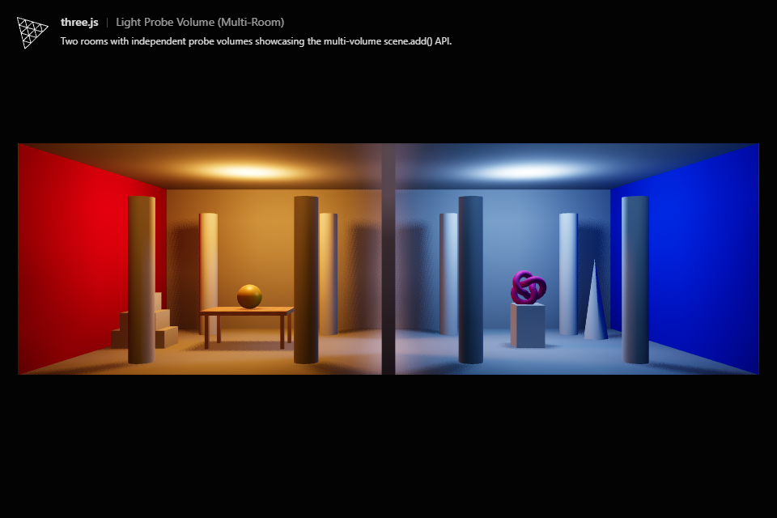
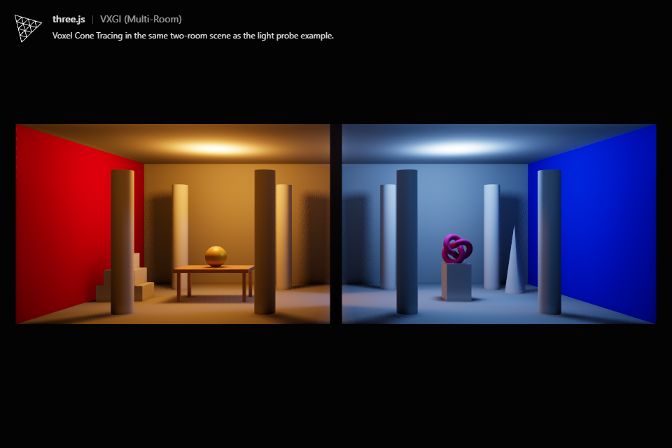
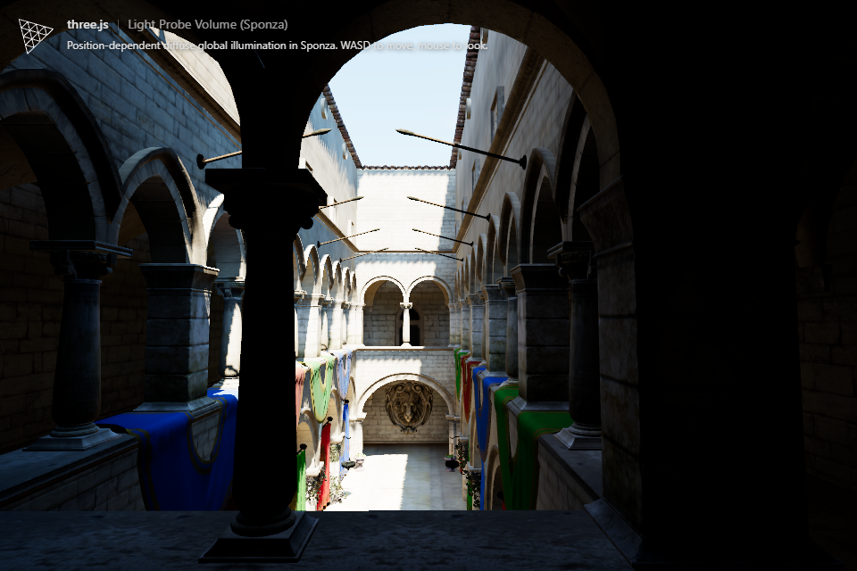
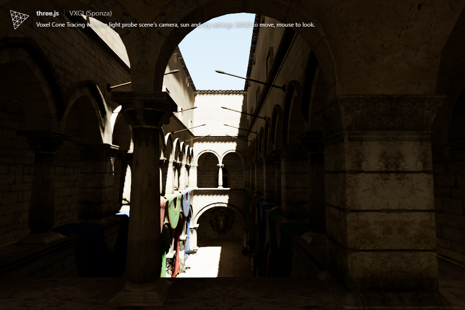

# VXGI future directions

Review date: October 9, 2026. This review covers this repository's WebGPU/TSL voxel cone tracing implementation, not NVIDIA's proprietary VXGI SDK. Recommendations below are based on source inspection unless explicitly identified as measurements or published production experience.

## Findings and recommended order

The implementation has a useful core: conservative compute voxelization, fractional sub-voxel occupancy, anisotropic opacity filtering, optional directional radiance, cached diffuse bounces, and temporal sampling. Its current design suits static, bounded scenes with changing lights. The largest gaps are deterministic voxel attributes, environment illumination, material fidelity, update scheduling, and spatial scalability.

For these examples, prioritize correctness before increasing resolution. Then reduce the full-resolution gather cost. For moving objects or larger worlds, replace repeated CPU collection and whole-volume rebuilds with persistent geometry and spatially limited GPU updates.

| Priority | Proposed work | Expected benefit | Main cost or risk |
| --- | --- | --- | --- |
| 1 | Deterministic, coverage-aware voxel attribute resolution | Stable normals/colors at intersections | More atomics, storage, or a second resolve stage |
| 1 | Visibility-aware sky/environment lighting | Correct outdoor and window illumination | Must avoid counting the sky twice |
| 1 | Explicit invalidation for geometry, materials, and shadow changes | Cached lighting stays correct | Requires renderer/scene integration |
| 2 | Half-width/half-height GI with depth/normal-aware upsampling | Reduce final gather workload | Thin features and disocclusion need care |
| 2 | GPU material sampling and persistent indexed geometry | Better textures and faster rebuilds | More binding and material management |
| 3 | Occupied-voxel compaction and dirty-region updates | Cheaper relighting and geometry changes | Compaction overhead can outweigh savings |
| 3 | Cascades/clipmaps or bounded local volumes | Preserve nearby detail in large worlds | Transitions, update budgets, and memory |
| 4 | Near/far radiance caching and hybrid visibility | Scale gather cost and contact detail | Additional cache bias and history management |
| 4 | Glossy transport, translucency, broader light support | More complete GI | Substantial extra representation and tracing work |

These are proposed changes, not performance gains already demonstrated in this branch.

## Comparable example scenes

The multi-room VXGI example uses `LightingComparisonScene( true )`, exactly as `webgpu_lightprobes_complex.html` does. The Sponza VXGI example already existed; it has been aligned with `webgpu_lightprobes_sponza.html` rather than duplicated.

| Input | Multi-room pair | Sponza pair |
| --- | --- | --- |
| Geometry and materials | Same shared scene, including its loaded wood material | Same glTF sample asset and removal of embedded lights |
| Camera | FOV 50; position `(0, 2.5, 16)`; target `(0, 2.5, 0)` | FOV 60; position `(-10.25, 4.99, 0.40)`; rotation `(1.6505, -1.5008, 1.6507)` |
| Source lighting | Same warm/cool point lights, intensity 30, shadow settings | Same SunLight color `0xfff2dc`, intensity 100, azimuth -75 degrees, elevation 60 degrees |
| Sky | Same dark background | Same SkyMesh parameters, static clouds, sun disc disabled |
| Display | ACES filmic, exposure 1; same pixel ratio | ACES filmic, exposure 1; pixel ratio capped at 1.5 |
| GI multiplier / extra ambient | Unit VXGI multiplier; no additional ambient light | Unit VXGI multiplier; removed VXGI's previous ambient fill and 1.5 multiplier |
| Extra AO | Disabled in VXGI, since probes add no separate AO term | Disabled in VXGI |
| Cached extra bounce passes | 0, matching the probe bake's default | 1, matching the probe example |

Bounce terminology needs care: VXGI `bounces = 0` still gathers directly lit surfaces, producing a first indirect bounce at the visible receiver. Its cached bounce passes add further surface interactions. Similarly, probe bake pass 0 captures directly lit surfaces, and subsequent passes add indirect transport.

Some controls have no equivalent: 128 voxels along the longest scene axis is not comparable numerically to a 6-by-6-by-6 probe grid or the Sponza 10-by-7-by-7 probe grid. The examples retain voxel/cone controls for investigation. Antialiasing also differs: VXGI uses single-sampled normal/depth and color passes with TRAA; the probe examples render with MSAA. The renderer's antialias option remains enabled, but the VXGI offscreen passes explicitly disable MSAA as required by TRAA. Do not use edge pixels to judge GI agreement.

Matched scene inputs do not imply equivalent transport. In Sponza, probes capture the visible sky during baking. VXGI excludes SkyMesh from voxelization and has no environment term when a cone escapes. Both use SunLight for direct rendering, but the probe baker substitutes a scene-fitted directional light for capture shadows; VXGI uses voxel visibility for SunLight injection rather than sampling view-fitted cascades. These differences remain visible and are documented rather than compensated with arbitrary fill lighting.

### Captured results

The following captures use a hardware NVIDIA adapter, a 960-by-640 viewport, device pixel ratio 1, and settled static views. The inspector is hidden in the captures.

| Scene | Light probes | VXGI |
| --- | --- | --- |
| Multi-room |  |  |
| Sponza |  |  |

**Observed:** The multi-room versions retain the same warm/cool separation, but VXGI is darker around the divider and some occluded surfaces. Sponza differs substantially: the probe version has cooler, brighter indirect illumination in several shaded areas; VXGI has warmer, darker surface lighting and different local visibility around the foreground architecture.

**Likely explanations:** Missing sky transport is a strong explanation for the Sponza color/brightness difference. Coarse visibility, surface offsets, isotropic radiance filtering, and representative normal/material selection can explain local differences. Probe interpolation and independently fading room volumes can also soften occlusion or leak illumination. The captures alone do not isolate each cause.

Neither method is a ground-truth reference. A path-traced reference with identical inputs is needed to establish which result is more accurate. Raising GI intensity until the pictures look similar would conceal missing transport and would not establish correctness.

## What the implementation does

| Stage | Where | CPU or GPU | Update frequency |
| --- | --- | --- | --- |
| Bounds, transforms, triangle/material collection | [VXGISceneCollector.js](examples/jsm/lighting/vxgi/VXGISceneCollector.js) | CPU; canvas texture reads | Initial voxelization and explicit invalidation |
| Grid setup, upload, kernel construction | `_voxelize()` in [VXGIVolume.js](examples/jsm/lighting/vxgi/VXGIVolume.js) | CPU submits GPU work | Initial voxelization and explicit invalidation |
| Conservative triangle coverage | `_createVoxelizeKernel()` | GPU compute | Voxel rebuild |
| Opacity resolve and mip filtering | Resolve / opacity mip kernels | GPU compute | Voxel rebuild |
| Light collection and cache key | `_collectLights()` | CPU scene traversal | Every frame |
| Direct radiance injection, cached bounces, radiance mips | `_updateLighting()` | GPU compute | Lighting invalidation or light-key change |
| Pixel GI/AO gather | [VXGINode.js](examples/jsm/lighting/vxgi/VXGINode.js) | GPU fragment pass | Every rendered frame |
| Cone integration | [VXGIConeTracer.js](examples/jsm/lighting/vxgi/VXGIConeTracer.js) | Generated GPU code | Gather, cached bounce, or visibility tracing |
| Temporal reconstruction | [TRAANode.js](examples/jsm/tsl/display/TRAANode.js) | GPU fragment pass | Every rendered frame |

The collector stores 20 floats, or 80 bytes, per triangle record. It duplicates world-space positions, resolves a single albedo/emission value per original triangle, expands instances on the CPU, and subdivides large triangles using a JavaScript stack before upload. The GPU assigns one invocation per resulting triangle and loops over its projected sub-voxel footprint.

The volume stores eight binary sub-voxel occupancy bits per voxel. Axis-dependent opacity comes from projected coverage and is combined along each axis before averaging across it. Radiance is stored premultiplied by occupancy. The optional directional mode stores six coarser directional blocks. These are useful anti-leak measures already present; this implementation is not simply ordinary isotropic mipmapping of an opaque voxel grid.

Final gathering uses three cosine-weighted cones by default, 40-degree aperture, step scale 0.5, a surface-normal offset of 1.5 voxels, and at most 128 steps per cone. Cone diameter selects mip level; tracing terminates at the volume boundary, requested maximum distance, or accumulated opacity 0.98. Cached bounces use eight cones per occupied voxel. Only diffuse outgoing radiance is represented.

The original cone-tracing work uses a GPU-built hierarchical voxel representation and prefiltered radiance/visibility. This repository implements the same broad integration idea with dense textures and compute kernels, trading sparse storage for straightforward filtering and access. It does not implement the original paper's complete scene-update or glossy representation. [Crassin et al., 2011](https://research.nvidia.com/sites/default/files/pubs/2011-09_Interactive-Indirect-Illumination/GIVoxels-pg2011-authors.pdf).

## CPU usage: where GPU work would help

**Yes, rebuilding uses more CPU work than a scalable dynamic implementation should. No, ordinary static-frame cone tracing is not running on the CPU.** Heavy triangle collection is cached until `needsUpdate` is set. Moving that work to the GPU primarily helps startup, geometry/material changes, instancing, and animation; it does not directly remove the steady-state pixel gather cost.

Specific CPU costs and proposed replacements:

1. **World-space expansion:** Upload persistent indexed positions/UVs once, with per-instance transforms. Transform vertices in compute. Share geometry across instances instead of creating complete triangle copies for each instance.
2. **Texture readback and centroid shading:** `getImageSampler()` creates a 64-by-64 CPU-readable image per texture for each collection. Sampling/material caches are local to that collection. Sample original textures on the GPU at voxel intersections, or cache explicit GI material data across rebuilds. A worker can reduce main-thread stalls for current preprocessing, but cannot fix its material approximation or eliminate upload traffic.
3. **CPU subdivision:** Move triangle work subdivision/binning into a GPU work queue, or reuse indexed mesh rasterization for voxelization. Avoid assuming a native hardware conservative-rasterization path is available through WebGPU; the existing compute coverage method is a portable starting point.
4. **Repeated scene traversal:** Cache light lists and use explicit revisions for transforms/materials/shadows. Avoid allocating string keys and calling `toFixed()` for every light every frame when event/version-based invalidation is available.

NVIDIA's GPU voxelization guidance selects the dominant projection axis and uses conservative coverage to avoid cracks. The current compute kernel implements these ideas, but constructs its input records on the CPU and serializes each triangle's footprint within one invocation. A tiled GPU implementation should preserve coverage while improving workload balance. Native examples using geometry shaders and hardware conservative rasterization cannot be copied directly into a WebGPU pipeline. [The Basics of GPU Voxelization](https://developer.nvidia.com/content/basics-gpu-voxelization).

### Small hardware measurement

One instrumented Chromium/Puppeteer run used the NVIDIA Ampere WebGPU adapter on an RTX 3060 Ti. WebGL adapter inspection independently reported NVIDIA/Direct3D11, not SwiftShader. Four matching scenes loaded; the VXGI examples rendered Combined, Direct, and GI views and survived a viewport resize without WebGPU validation errors. The only failed resource in the multi-room run was `/favicon.ico`.

| Measurement | Multi-room VXGI | Sponza VXGI |
| --- | ---: | ---: |
| Effective padded grid | 144 × 48 × 80 | 144 × 64 × 96 |
| World-space voxel size | 0.125 | 0.23255 |
| Uploaded triangle records | 15,098 | 274,627 |
| First `_voxelize()` JavaScript elapsed time | 41.8 ms | 145.1 ms |
| First `_updateLighting()` JavaScript elapsed time | 8.2 ms | 14.1 ms |
| Mean `_collectLights()` JavaScript elapsed time | 0.017 ms | 0.016 ms |
| GPU VXGI gather pass, mean of 60 resolved samples | 2.52 ms | 3.76 ms |
| GPU TRAA pass, same sample window | 0.77 ms | 0.41 ms |

The JavaScript timings include kernel creation/compilation and command submission; they do not isolate triangle collection and do not wait for GPU completion. GPU pass times come from the renderer inspector's timestamp records. They are a diagnostic sample, not a repeatable multi-run benchmark or total-frame speedup claim. Nested inspector pass measurements must not be added blindly. No claim is made here about sustained relighting or animated-scene performance.

The measured light traversal is small in these scenes. The initial rebuild stall is much larger, while final gathering is a material per-frame GPU cost. This supports addressing rebuild preparation and final gather separately.

## Accuracy and light leaking

### 1. Representative attributes have a write race

In `_createVoxelizeKernel()`, occupancy uses `atomicOr`, but `triangleIds.element( voxelIndex ).assign( triangleIndex.add( 1 ) )` is an ordinary competing write. Multiple invocations can touch a voxel, so its final representative triangle depends on execution order. `_surface()` then uses that triangle's albedo, emission, side, and flat normal for the entire voxel, even though occupancy combines all triangles.

This is a correctness issue identified from source, not a demonstrated crash. WGSL only supplies atomic ordering guarantees for atomic accesses; an ordinary competing store is not a valid deterministic attribute reduction. [WGSL atomic built-in functions](https://www.w3.org/TR/WGSL/#atomic-builtin-functions).

**Proposal:** First implement a deterministic atomic winner, such as a defined minimum triangle ID, as a regression baseline. This fixes nondeterminism but not fidelity. Then accumulate coverage-weighted attributes or resolve a small set of surface candidates per voxel/direction. Simply averaging opposing normals is insufficient: two sides of a wall can cancel or mix unrelated materials. Validate with intersecting red/blue surfaces, reversed triangle order, repeated rebuilds, and thin parallel walls.

### 2. Increasing grid resolution does not repair triangle-centroid textures

The collector samples at the original triangle's UV centroid before subdividing. Child records inherit that same color. A large textured triangle therefore keeps one color even if later subdivision produces many finer geometry records. Texture images are also downscaled to 64-by-64. Compressed or unreadable images fall back to material color.

Alpha testing similarly accepts or rejects an entire triangle from its centroid sample. Curtains, foliage, cutouts, and tiled materials can have incorrect blocker geometry and reflected color. Normal maps, interpolated vertex normals, vertex colors, metallic diffuse attenuation, transmission, and arbitrary node material graphs are not evaluated by this collector.

**Proposal:** Compute barycentric UVs at covered sub-voxel locations and sample GPU textures with a voxel-footprint LOD. Support a deliberately defined GI material subset rather than implying full forward-material parity. Include metallic energy handling and a clear two-sided policy. A cheaper intermediate option is an offline or persistent GI texture/material proxy, with documented error.

### 3. Missing environment transport

`isVoxelizable()` explicitly excludes SkyMesh, and escaped cones contribute no radiance. Sky visibility is therefore absent from both surface injection and the final cone gather. Ambient and hemisphere lights are also outside `_collectLights()`'s supported types; RectAreaLight is not injected.

**Proposal:** Add an environment-radiance provider. An escaping cone should gather remaining transmittance times filtered environment radiance when it actually exits the represented scene. Do not substitute the sky after reaching `maxSteps`, an artificial maximum distance, or an occluded termination. Include environment illumination of voxel surfaces so further bounces receive skylight. Define which term accounts for each interaction to prevent double counting at visible receivers.

For a controlled first experiment, compare a constant-radiance environment and then the same procedural sky. This is a more informative Sponza test than adding an unoccluded ambient light.

### 4. Filtering cannot preserve all thin blockers

Conservative occupancy prevents geometric cracks, but coarse cone footprints combine unrelated surfaces. Isotropic radiance can mix the illuminated side of a wall with its dark side, even though opacity is anisotropic. Directional radiance reduces this failure but does not restore lost fine geometry. The finest radiance level is still isotropic, and the directional lookup switches representation at LOD 1 rather than explicitly blending finest isotropic and coarser directional data across that boundary.

**Proposal:** Test directional radiance before simply doubling voxel count. Add a continuous finest-to-directional LOD transition. Test axis-aligned and diagonal thin walls separately. Consider separate blocker occupancy, directional surface attributes, or conservative occlusion proxies for important architecture. Inflating every wall or forcing every occupied mip cell opaque prevents some leaks at the cost of excessive darkening; neither is an unbiased fix.

### 5. Origin offsets trade self-occlusion for missed detail

At 128 resolution, the Sponza gather's 1.5-voxel normal offset is about 0.35 world units; tracing also starts at least one voxel along the ray. For the multi-room scene the normal offset is 0.1875, significant relative to the 0.3-thick divider and 0.12-thick tabletop. These offsets can move a query through nearby geometry or skip a narrow light path. Lowering them can instead sample the surface's own conservative voxels and darken the result.

**Proposal:** Use an actual surface position/coverage estimate where possible, distinguish geometric and shading normals, and add a higher-resolution near-field visibility test. Measure bias sensitivity against thin walls and contact patches rather than tuning one global offset from a Cornell box.

### 6. Shadow equivalence and stale cached lighting

Voxel injection samples existing directional/spot/point shadow depth with a single comparison. It does not reproduce the direct renderer's filtering, shadow radius, normal bias, or full shadow-node behavior. Injection evaluates at a voxel center plus an offset, not at the original material surface. The added SunLight path preserves direction/intensity and avoids misinterpreting its cascade atlas as an ordinary shadow map; it uses voxel-cone visibility instead.

`_collectLights()` includes light values and shadow texture identity in its cache key, but not shadow matrix contents, map content revisions, or general caster/material changes. A camera-fitted shadow matrix can change without its texture UUID changing. Geometry changes require explicitly setting `volume.needsUpdate`; animated/morphed/skinned positions are not automatically collected from GPU deformation.

**Proposal:** Introduce explicit shadow/content revision tracking and renderer update ordering. For Sponza parity, use the same scene-fitted injection shadow representation as the probe baker, or implement a supported cascade-aware injection path with coverage and invalidation. Avoid using a camera-limited cascade for offscreen voxel surfaces without a fallback.

## Resolution and world scalability

The requested resolution sets voxel size to `longestSceneExtent / resolution`. The remaining axes use the same voxel size and are padded/aligned for mip processing. This preserves isotropic world-space voxels and avoids forcing every scene into a cubic grid. It still has two major scaling limits:

1. Enlarging the scene at fixed resolution increases world-space voxel size everywhere. A distant object added to the automatic bounds can reduce detail inside the room currently being viewed.
2. Doubling resolution in all three dimensions grows base storage and dense dispatch work by approximately eight times. CPU subdivision can also increase the uploaded triangle count. Cone tracing cost does not necessarily grow eightfold, because mip selection and early termination affect its step count.

The implemented radiance/opacity mips are **not clipmaps**: they coarsen one bounded volume. A clipmap keeps fine resolution near an anchor while adding progressively larger spatial coverage at coarser levels.

### Approximate voxel storage

For an isotropic grid with `N` base voxels, the nominal allocation is roughly:

`N × (4 × 8/7 + 2 × 8 × 8/7 + 8 + 2 × 4) = 38.86 N bytes`

This includes RGBA8 opacity mips, two RGBA16F radiance mip chains, RGBA16F direct radiance, and two uint32 voxel buffers. The `8/7` factor approximates a full 3D mip chain. With directional radiance, the corresponding estimate is approximately `54.29 N` bytes, including its normal texture and two six-direction half-resolution mip chains. Allocation alignment, actual mip dimensions, tiny placeholder textures, and backend overhead are omitted.

| Grid example | Isotropic voxel allocation | Directional voxel allocation |
| --- | ---: | ---: |
| Captured multi-room: 144 × 48 × 80 | 20.5 MiB | 28.6 MiB |
| Captured Sponza: 144 × 64 × 96 | 32.8 MiB | 45.8 MiB |
| Cubic scene at requested 64: padded 72³ | 13.8 MiB | 19.3 MiB |
| Cubic scene at requested 128: padded 144³ | 110.7 MiB | 154.6 MiB |
| Cubic scene at requested 256: padded 288³ | 885.2 MiB | 1,236.7 MiB |

Add `80 × triangleRecordCount` bytes for geometry: approximately 1.15 MiB in the captured multi-room case and 20.95 MiB in Sponza. These estimates exclude source meshes/textures, shadow maps, normal/depth/velocity buffers, GI targets, and temporal history. They are allocation calculations, not measured GPU memory usage. A practical implementation should validate actual device storage-binding and 3D texture limits before offering higher resolutions; the 256 cap alone does not guarantee every scene fits.

### Proposed scalable representation

Start with either bounded local volumes for a few rooms or two/three camera-centered clipmap levels for a world. Retain scene-global coarse illumination or an environment fallback so near-volume boundaries do not become black. Use overlap and a deliberate transition policy; independently fading physical contributions can double count light if the blend is not normalized.

For clipmaps, snap the anchor to voxel increments, reuse persistent geometry/material buffers, update newly exposed slabs and changed object regions, and regenerate affected mip ancestors. Moving an object requires invalidating both its old and new extents. A changed light can affect far more than its containing brick, especially after multiple bounces; local dirty geometry updates and local dirty lighting updates require separate policies.

Use frame budgets: prioritize newly visible or changed regions, update far regions less often, and provide valid history/fallback while work is pending. Maintain a dense low-cost path for small scenes. Sparse bricks or an octree can save empty-space memory, but introduce allocation, traversal, and filtering complexity; they are not automatically faster than a well-budgeted dense clipmap.

## What professional game implementations do differently

These examples demonstrate documented approaches, not a claim that all games use NVIDIA VXGI or one common GI system. Modern alternatives below are useful design comparisons and are not drop-in VXGI implementations.

| Presentation or source | Published lesson | Implication for this code |
| --- | --- | --- |
| [NVIDIA VXGI: Dynamic Global Illumination for Games, GDC 2015](https://developer.download.nvidia.com/assets/events/GDC15/GEFORCE/VXGI_Dynamic_Global_Illumination_GDC15.pdf), especially slides 11–14 and 22–25 | Uses camera-centered voxel clipmaps, GPU material voxelization, persistent temporal tracers, diffuse and rough specular channels | Move beyond a single whole-scene mip volume; keep voxel material evaluation on the GPU |
| [Advances in Real-Time Voxel-Based GI, GDC 2018](https://www.gdcvault.com/play/1024800/-Advances-in-Real-Time), Alexey Panteleev and Rahul Sathe | Session describes practical VXGI improvements and planar area lighting combining analytic irradiance with voxel occlusion | Treat emitter sampling and occlusion as separable; consider explicit area-light support |
| [The Tomorrow Children: Lighting and Mining with Voxels, SIGGRAPH 2015](https://history.siggraph.org/wp-content/uploads/2022/10/2015-Talks-McLaren_The-Tomorrow-Children-Lighting-and-Mining-with-Voxels.pdf), James McLaren and Tao Yang | PS4 implementation uses texture cascades, 16 fixed directions, precombined directional data, cached far traces, and a cheaper SH field for particles | Reuse low-frequency far transport instead of tracing it separately for every screen pixel |
| [Scalable Real-Time Global Illumination for Large Scenes, GDC 2019](https://www.gdcvault.com/play/1026469/), Anton Yudintsev | Gaijin's Enlisted presentation discusses a probe field evaluated from voxels/triangles, multiple bounces, indoor probe bleeding, foliage, and memory/performance | A voxel representation and a cheap irradiance cache can complement each other |
| [Shipping Dynamic Global Illumination in Frostbite, SIGGRAPH 2024](https://advances.realtimerendering.com/s2024/content/EA-GIBS2/Apers_Advances-s2024_Shipping-Dynamic-GI.pdf), Diede Apers | Production surfel/probe system uses clipmaps, visibility-weighted probe interpolation, prioritized updates, GPU workload compaction, and quarter-rate application | Allocate a bounded work budget and reuse cached transport; prevent leaks in the lookup as well as the geometry |
| [Lumen Technical Details, Epic Games](https://dev.epicgames.com/documentation/en-us/unreal-engine/lumen-technical-details-in-unreal-engine) | Combines scene representations and screen traces, amortizes cached lighting, and documents content constraints for thin walls | Hybrid visibility and authoring rules remain necessary even in mature production systems |

For the GDC 2018 and 2019 entries, the session abstracts were accessible. The linked NVIDIA 2018 slide download returned an access error; its detailed one-pass-voxelization and filtering claims are not treated as independently verified in this review. The GDC 2015 deck and SIGGRAPH 2015/2024 documents above were read directly.

The Tomorrow Children is particularly relevant because it is an actual console VCT design rather than only a generic GI discussion. Its central lesson is reuse: spatial cascades and cached far-field directional traces reduce redundant per-pixel transport, while a cheaper irradiance field serves effects that cannot afford full tracing. A dense texture representation can be professional; the missing ingredient here is its spatial/update/gather strategy, not necessarily the absence of an octree. [McLaren and Yang, SIGGRAPH 2015](https://history.siggraph.org/wp-content/uploads/2022/10/2015-Talks-McLaren_The-Tomorrow-Children-Lighting-and-Mining-with-Voxels.pdf).

Frostbite's 2024 talk gives a useful budget example: College Football 25 freezes irradiance updates during 60 Hz gameplay after preparing lighting during its preload sequence. The reported Skate test uses quarter-rate application and bounded, prioritized updates; an optimized Xbox Series X run averaged about 2.5 ms for its GI system. These are engine-specific figures, not predictions for WebGPU VXGI. The talk also shows that excessive surface-origin offsets can cause leaking. Its relevance is the scheduling and bias discipline, not the use of ray tracing hardware unavailable to this implementation. [Apers, SIGGRAPH 2024](https://advances.realtimerendering.com/s2024/content/EA-GIBS2/Apers_Advances-s2024_Shipping-Dynamic-GI.pdf), slides 16, 39–41.

Epic documents thin-wall representation failures and a 10 cm wall-thickness recommendation for Lumen's software distance-field path. That is a rule for that representation, not a universal VXGI wall threshold. Here the useful threshold is relative to world-space voxel size, filtering footprint, and bias. Raising resolution locally for important blockers and using modular, closed architectural geometry is more defensible than assuming all single-sided planes remain reliable at arbitrary scene scale. [Epic Games, Lumen Technical Details](https://dev.epicgames.com/documentation/en-us/unreal-engine/lumen-technical-details-in-unreal-engine).

## Faster final gathering and relighting

### Changes likely to be useful for the current examples

**Reduced-resolution GI:** The render target is always sized to the drawing buffer. Add an independent GI resolution scale, start at half width/height, and reconstruct with depth and geometric-normal checks. This reduces the number of gather pixels to one quarter, not necessarily the total frame time to one quarter. Keep direct shading at full resolution. Measure halos on columns, the doorway, thin rods, and cloth edges.

**Dedicated GI denoising/history:** `useTemporalFiltering` changes the cone sample sequence; VXGINode itself does not maintain a reprojected GI history. The example's TRAA filters the combined color. A GI-specific temporal filter can track lighting revisions, normal/depth rejection, variance, and confidence without smearing high-frequency direct textures. Reset or attenuate history when voxel resolution, bounds, material data, or lighting changes. Compare temporal trails and disocclusion settling, not just a still image.

**Separate debug and beauty kernels:** Debug voxel marching currently follows the ordinary gather in the same shader. Specialize debug output so investigation does not pay for both paths. Avoid treating debug-mode timings as beauty-mode costs.

**Shadow update policy:** The shared source scenes update shadows during normal rendering. For static geometry and lights, explicitly cached shadow maps can save work, provided voxel injection has an up-to-date map before relighting. Reuse the renderer's versioning rather than adding another independent cache heuristic.

### Changes for frequently changing lighting or geometry

**Occupied-voxel work lists:** Injection and cached bounce dispatches cover the whole dense grid, with an occupancy test inside. A GPU-compacted occupied list can avoid empty invocations and enable indirect dispatch. Output volumes must still have correct zero values for empty cells; build/clear costs and changed occupancy must be accounted for. Mip filtering remains dense unless separately tiled.

**Many-light selection:** The default `maxLights` is eight, and collection stops admitting lights at that limit. Increasing it also increases unrolled injection work and shadow bindings. A production system needs a deliberate light-selection or spatial-light-list policy, with diagnostics for lights excluded from GI. Treating scene traversal order as the selection policy will become misleading in larger scenes.

**Persistent material attributes:** Cache resolved albedo/emission/normal at voxelization. Repeated `_surface()` calls currently reload triangle vertices and reconstruct flat normals in both injection and bounces. Extra attribute storage may lower bandwidth and arithmetic during frequent relighting; test the tradeoff against the existing triangle record layout.

**Budget cached bounces:** A changing light currently regenerates injection, radiance mips, each complete bounce, and the corresponding mip chains in one update. Schedule bounce propagation over multiple frames where latency is acceptable. Label partially updated data and keep a stable read buffer to prevent a mixture of stale and new transport from oscillating.

**Near/far split:** Cache smooth distant transport in directional world-space samples or irradiance probes, gather detailed nearby visibility at pixels, and blend at a specified distance. This is a larger architectural change but directly targets repeated cone work. Keep an uncached reference mode to measure the resulting bias.

**GPU use is not sufficient by itself:** Moving CPU subdivision to a serial GPU loop can shift a stall rather than remove it. Design work distribution, memory layout, occupancy lists, and task size together. Avoid CPU readback of voxel or work-list data each frame. WebGPU queue submission can overlap with CPU work, but this code should not promise explicit native graphics/async-compute queue control or RT-core acceleration through its present API.

## Validation plan for follow-up work

1. **Determinism:** Rebuild intersections repeatedly and reverse triangle/object order. Compare resolved voxel attributes before temporal filtering.
2. **Transport reference:** Export identical geometry, materials, source lights, sky, and exposure to a path tracer. Compare linear HDR diffuse terms, with tone-mapped images only as presentation.
3. **Leak fixtures:** Include a bright room beside a dark room, doorway/lintel, thin diagonal wall, closed box, cutout curtain, emissive panel, and geometry immediately outside the volume. Sweep wall thickness relative to voxel size.
4. **Controlled ablations:** Disable the sky in the probe capture, turn VXGI directional radiance on/off, set equal cached bounce passes, vary offset independently of resolution, and compare Direct-only views before comparing GI.
5. **Resolution/cost sweep:** Use 64/128/256 voxels, 2/3/6 cones, and full/half GI resolution. Record padded dimensions, triangle records, allocation estimates, CPU collection time, upload/compilation time, and GPU voxelize/inject/mip/bounce/gather times separately.
6. **Dynamic validity:** Move an occluder and a light; change albedo/emission; toggle shadows; move the camera through cascades; test instanced and skinned content. Verify both old and new geometry regions, cache invalidation, and history settling.
7. **Scalability:** Add distant geometry without changing the local room. Test sparse outdoor scenes, many lights, fast camera motion, and a room grid. Report cold-start, steady-state, relighting, and rebuild costs separately across multiple runs.

The initial branch validates the matched examples and documents these gaps. The proposed algorithmic redesigns, path-traced accuracy metrics, broad device benchmarks, and production-scale update strategies remain future work.
